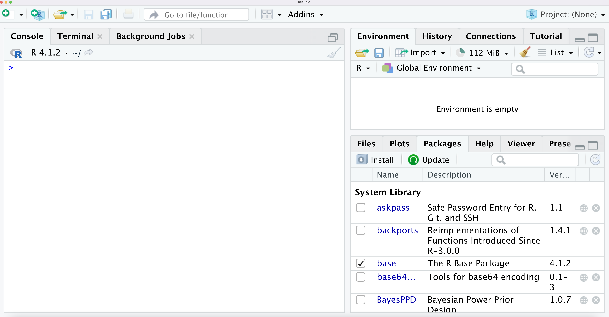

# Getting Started {#intro}

## [**R**]{style="color:#D96716"} and [**RStudio**]{style="color:#D96716"}

* **R**

  + [**Free**]{style="color:#D96716"} software developed by R Core Team
  + Available at [https://www.r-project.org/](https://www.r-project.org/)
  + Software and packages are managed by the nonprofit organization "R Foundation"

* **RStudio**

  + An **integrated development environment** (IDE) for programming in **R**.
  + Provides many add-ons to **R** available in a single interface.
  + Developed by RStudio, Inc.
  + Available in both **free** (AGPLv3) and commercial editions at [https://www.rstudio.com](https://www.rstudio.com)


---

* **R** and **RStudio** are separate things. 
    + You should install R first before RStudio

* **R**

  + Download and install R at [https://cloud.r-project.org/](https://cloud.r-project.org/)

* **RStudio**

  + Download and install the open source version of RStudio Desktop at [https://rstudio.com/products/rstudio/download/#download](https://rstudio.com/products/rstudio/download/#download)


* When you open **Rstudio**, it should look something like:
{width="800" height="450"}

* The **left-hand panel** of RStudio is where you can type in **R** code directly.

* For example, we can treat R as a **calculator** and add and multiply numbers by typing them directly in the left-hand panel.

* Typing and running **R** code line-by-line like this is referred to as using **R** in **interactive mode**. 

* When writing more complex code that you can reuse, it is usually better
to write it in a **separate file** such as an **R script** (this type of file ends in .R).

* To create a new **R** script, go to **File --> New File --> R script** in Rstudio.

{width="750" height="400"}

---

* As an example of writing and running **R scripts**, let's write an **R** script that will simply print 
out the message **"Hello World"** whenever we run the script.

* To do this we just write the following **R** code in
the empty **R** script/l

``` r
"Hello World"
```

{width="850" height="400"}


* Before running the script, you can save the file as **"hello_world.R"**.


* To run the script, just click the **"Run"** button located at the top right of your 
**R** script.

* The message "Hello World" should appear in the **R** console below:
{width="700" height="400"}


## An Extended Example: the NYC flights data

* To illustrate some of the capabilities of R for exploring and summarizing data, we will look at the **"NYC flights"** dataset.

* This is a dataset that contains information on flights that departed from the New York City region in 2013.

* This dataset is available in an R package called **"nycflights13"**

### Installing R packages

* To use an R package, you must first **install it**.

* Installing the `nycflights13` package can be done with the following command:

``` r
install.packages("nycflights13")
```


* Note that, if a package has been installed previously, you don't need to install it again in order to use it.

--

* Once an R package has been installed, you can **"load"** it into your R session with the `library` function:

``` r
library(nycflights13)
```

* Running the `library` command just makes the datasets in the `nycflights13` package **available** for
you to use in your R session.

### NYC flights data details

* There are 5 datasets in the `nycflights13` package: `airlines`, `airports`, `flights`, `planes`, `weather`

* Let's first look at the `planes` dataset.

* This dataset is stored as a **data frame** in R.
    + Using a **dataframe** is the most standard way to store a dataset in R

* An R data frame has a certain number of **rows** (which usually represent different observations)
and **columns** (which usually represent different variables).
    
    - I will refer to the variables in a data frame as **"data variables"**.
    
    - This is to distinguish it from **R variables** that you can create in your R session.


---

*  The `planes` data frame has **3322 rows and 9 columns**.

* The number of rows and columns of a data frame can be found by using the `dim` function. 

``` r
dim(planes)
```

```
## [1] 3322    9
```

* Each row of the `planes` data frame contains information about a **specific airplane**.

* You can look at the contents of the **first 6 rows** of a data frame by using the `head` function

``` r
head(planes)
```

```
## # A tibble: 6 × 9
##   tailnum  year type               manufacturer model engines seats speed engine
##   <chr>   <int> <chr>              <chr>        <chr>   <int> <int> <int> <chr> 
## 1 N10156   2004 Fixed wing multi … EMBRAER      EMB-…       2    55    NA Turbo…
## 2 N102UW   1998 Fixed wing multi … AIRBUS INDU… A320…       2   182    NA Turbo…
## 3 N103US   1999 Fixed wing multi … AIRBUS INDU… A320…       2   182    NA Turbo…
## 4 N104UW   1999 Fixed wing multi … AIRBUS INDU… A320…       2   182    NA Turbo…
## 5 N10575   2002 Fixed wing multi … EMBRAER      EMB-…       2    55    NA Turbo…
## 6 N105UW   1999 Fixed wing multi … AIRBUS INDU… A320…       2   182    NA Turbo…
```

* The `planes` data frame has 9 variables.
`tailnum`: The tail number of the plane. This number is a unique identifier for each plane
`year`: The year the plane manufactured.
`type`: The type of plane.
`manufacturer`: manufacturer of the plane
`model`: model of the plane
`engines`: number of engines that the plane has
`seats`: number of seats that the plane has
`speed`: Average cruising speed in mph.
`engine`: Type of engine.

* Running the command `help(planes)` can give **more information** about this dataset.

### Summarizing specific data variables

* You can **access** individual variables from `planes` by using the `$` operator.

* For example, if we want to **assign** the values in the `year` column into a 
new **R variable** named plane_year, we do the following:

``` r
plane_year <- planes$year
```

* After running the above line of code, `plane_year` is an R `vector` that has 3322 elements.


* The `length` function tells us how many elements are in a vector

``` r
length(plane_year)
```

```
## [1] 3322
```

* We can look at the **first x elements** of `plane_year` by using the syntax `plane_year[1:x]`.

* For example, let's look at the first 5 elements of `plane_year`:

``` r
plane_year[1:5]
```

```
## [1] 2004 1998 1999 1999 2002
```

---

* We can get a count of how many times each value of `year` occurs by using the `table` function

``` r
table(plane_year)
```

```
## plane_year
## 1956 1959 1963 1965 1967 1968 1972 1973 1974 1975 1976 1977 1978 1979 1980 1983 
##    1    2    2    1    1    1    1    1    1    3    3    2    2    4    4    1 
## 1984 1985 1986 1987 1988 1989 1990 1991 1992 1993 1994 1995 1996 1997 1998 1999 
##    5   23   17   40   75   60   90  108  109   59   48   54   55   74  174  206 
## 2000 2001 2002 2003 2004 2005 2006 2007 2008 2009 2010 2011 2012 2013 
##  244  284  212  150  192  162  126  123  147   84   48   66   95   92
```

* The above **R output** says that **147** of the planes in the `planes` data frame were manufactured in 2008 and **92** planes in the `planes` data frame were manufactured in 2013.

* The `table` function is useful for data variables that have a relatively small number of distinct values.

* For **numeric** data variables that are better thought of as continuous variables, one often **summarizes**
these data variables by looking at things like the **mean**, **median**, or **standard deviation**.

* Using the `summary` function on a single data variable gives you a useful **"six-number summary"** about that data variable:

``` r
summary(planes$seats)
```

```
##    Min. 1st Qu.  Median    Mean 3rd Qu.    Max. 
##     2.0   140.0   149.0   154.3   182.0   450.0
```

---

* Another dataset available in the `nycflights13` package is the `weather` data frame.

* This data frame has **26115 rows** and **15 columns**.

``` r
dim( weather )
```

```
## [1] 26115    15
```

* You can output all of the data variable names by using the `names` function:

``` r
names( weather )
```

```
##  [1] "origin"     "year"       "month"      "day"        "hour"      
##  [6] "temp"       "dewp"       "humid"      "wind_dir"   "wind_speed"
## [11] "wind_gust"  "precip"     "pressure"   "visib"      "time_hour"
```

* One of the data variables is `month`. This just records what **month** the weather observation
was made in 

``` r
table( weather$month )
```

```
## 
##    1    2    3    4    5    6    7    8    9   10   11   12 
## 2226 2010 2227 2159 2232 2160 2228 2217 2159 2212 2141 2144
```

### Subsetting Data

* An important part of many data analyses is looking at data summaries of specific **subsets** of interest.

* To create a **new data frame** which is a subset of the original data frame, you can use the `subset` function.

* For example, if we only want to look at weather in the **month of January**, we can a new data frame
which only contains January observations (where `month` equals 1)

``` r
JanuaryWeather <- subset(weather, month==1)
```

* The `JanuaryWeather` data frame has **2226** observations

``` r
dim( JanuaryWeather )
```

```
## [1] 2226   15
```

* The **average temperature** over the month of January is

``` r
mean( JanuaryWeather$temp )
```

```
## [1] 35.63566
```

---

* One can take more complex subsets of a data frame by using **logical expressions**
in the second argument of the `subset` function.

* For example, if you wanted to create a data frame that only has observations in **February**
that are **above 40 degrees** Fahrenheit, you could use the following code:

``` r
FebAbove40 <- subset(weather, month==2 & temp > 40)
```


### Plotting Data

* **R** has many functions that can aid data visualization.

* For example, you can create a simple histogram of the temperature variable by using
the vector `weather$temp` inside the `hist` function:

``` r
hist( weather$temp )
```


* You could create **separate boxplots** of temperature for each month by using the modeling syntax 
`temp ~ month` within the boxplot function:


``` r
## Use x-axis label "Month" and y-axis label "Temperature" in the figure:
boxplot(temp ~ month, data=weather, xlab="Month",
        ylab="Temperature")
```


## Using R as a calculator

* When first starting with **R**, it can be helpful to note that **R** can be used as a basic **calculator**. 

* For example, if we just type in `42 + 17` into the R console, it should print out the sum:


``` r
42 + 17 
```

```
## [1] 59
```


* We can compute the square root of 243, $1.56^{124}$, and $7.21 \times 8^{4}$, just by typing these expressions into the **R console**

``` r
sqrt(243)
```

```
## [1] 15.58846
```

``` r
1.56*124
```

```
## [1] 193.44
```

``` r
7.21*8^4
```

```
## [1] 29532.16
```


## Variables in R

* When starting to work with more complicated mathematical operations in **R**, it is often useful to
store intermediate values in **named variables** instead of using **R** as a calculator in interactive mode.

* For example, the following **R** code creates the variables `x, y, z` and assigns
them the values $(42 + 17)\sqrt{43}$, $7.21(8^{4}) + \ln(2.34)$, and  
$(42 + 17)\sqrt{43}/[ 7.21(8^{4}) + \ln(2.34) ]$ respectively.

``` r
x <- (42 + 17)*sqrt(43)
y <- 7.21*8^4 + log(2.34)
z <- x/y
z  ## print out the value of z
```

```
## [1] 0.01310022
```

* Here, `x`, `y`, and `z` are examples of **variables**.

* The pair of characters `<-` used together is known as the **assignment operator** in **R**.
`x <- 2` assigns the value `2` to the variable `x`.

---

* In general, a **variable** is the **named storage** of a value (or an object) in memory.

* Why do we need variables?

  + To **reuse** the same value later on.
  + To **generalize** an expression to use in many cases.

* How to use variables in **R**?
  
  + To set the value of a variable, use **assignment** operator `<-`
  
  + To use the value, simply use the **variable name** as if it were its stored value.
  
* For example, ...


### Rules for choosing **variable names** in R

* Variables can be named however you want as long as you follow the 
several variable-naming rules that R has. 

* In **R** variable names can include the following:
  + **letters**: A-Z a-z
  + **digits**: 0-9
  + **underscore and period**: _ .

* Additional rules:
  + Variable names **must start with letters or a period (not underscore or digits)**
  + If a variable name starts with a **period**, it **cannot** be followed by a **number**.
  + Variable names are **case sensitive**.

* The following tables shows examples of **valid** and **invalid** variable names in R

|     Valid     |   Invalid    |
|:-------------:|:------------:|
|       i       |   2things    |
|  my_variable  |  location@   |
|   answer42    |  _user.name  |
|     .name     |     .3rd     |

* While you are free to choose variable names however you like as long as you follow the variable-naming rules of **R**, making variable names **descriptive** is highly **recommended**.

* **Descriptive** variable names make it easier to read code. This is very helpful if:
    + You are sharing your code or
    + Looking back at code you wrote many weeks/months ago

* Using a **consistent** convention for naming variables is recommended:

https://r4ds.had.co.nz/workflow-basics.html


### Variable Assignment

* Variables can be assigned using either `<-` or `=`


``` r
x = 123    # Use = to assign a variable
y <- 123   # Or use <- to assign a variable
```


``` r
x   # Retrieve the value of x
```

```
## [1] 123
```

``` r
y   # Retrieve the value of y
```

```
## [1] 123
```

* The pair of characters `<-` is the classic symbol used for variable assignment in **R**.

* The use of `<-` instead of `=` is often recommended in **R** style guides:
    + http://adv-r.had.co.nz/Style.html

---

* `<-` and `=` will work the same if they are both
used in the "usual way" (when assigning variables within 
or outside of a function).

* One exception, is when used inside a **function call**. For example, if we use `=` in the function `sd(x)`:


``` r
sd(x = c(1,2,3,4,5)) # only sets the argument x in sd(x) to (1,2,3,4,5)
```

```
## [1] 1.581139
```

``` r
#x      ## will return an error if we try to print x
```


``` r
sd(x <- c(1,2,3,4,5)) # This actually assigns the vector (1,2,3,4,5) to x
```

```
## [1] 1.581139
```

``` r
x
```

```
## [1] 1 2 3 4 5
```

* However, using something like `sd(x <- c(1,2,3,4,5))` where we assign variables in a function call is not really done that often. 

* It is **not common** to assign variables in a function call (I never do it).

* Whenever, using a function `f` with a keyword such as `x`, you will generally
want to call that function using `f(x = ...)`

* So, in my opinion, there is not really a strong reason to prefer using `<-` over `=` for assignment. 

* There are other justifications for using `<-` such as the ability 
to do assignment from the left by using the reverse symbol `->`

``` r
c(1, 2, 3, 4) -> a # Using c(1,2,3,4) = a will not work!  
a
```

```
## [1] 1 2 3 4
```


### Types of variables

* Variables can be used to store **different types** of values.

* Common types include numeric, text, and logical values.

``` r
x <- 3.2
x
```

```
## [1] 3.2
```

* Here, `x` is actually a **vector** (basically a collection of elements storing the same type of data).

* It is a vector of **length one** (i.e., it only has one element). 

* This is the reason why you see `[1]` printed out next to the number 3.2. 
    + This means that the **first element** of the vector `x` is $3.2$. 

* **R** treats every variable as some type of collection (e.g., vectors, matrices, lists, etc.).
    + There are no separate data types in **R** for individual numbers.


* The elements in a vector can have different **types** (or modes).

* You can find the types of the elements in a vector by using the
function **typeof**

``` r
y <- sqrt(1743)
typeof(y)  # double and integer are the two numeric types 
```

```
## [1] "double"
```


``` r
z <- 3 # R automatically treats every number as double
z
```

```
## [1] 3
```

``` r
typeof(z)
```

```
## [1] "double"
```

* The other common types for the elements in a vector include
    + **logical** (TRUE or FALSE) values
    + **character** basically text, e.g., "hello", "car", ...

``` r
y <- TRUE
typeof(y)   
```

```
## [1] "logical"
```


``` r
z <- "dog" # to define a character variable, place it inside quotes
typeof(z)
```

```
## [1] "character"
```

* We will discuss these types in more detail later on when
we discuss **vectors**, **matrices**, and **lists**.


## R Operations with numbers
  
* As we mentioned before, ...  


|    Operator    |       Meaning        |    Example    |    Result    |
|:--------------:|:--------------------:|:-------------:|:------------:|
|       +        |       addition       |     5 + 8     |      13      |
|       -        |     subtraction      |    90 - 10    |      80      |
|       *        |    multiplication    |     4 * 7     |      28      |
|       /        |       division       |     7 / 2     |     3.5      |
|       %%       |      remainder       |    7 %% 2     |      1       |
|       ^        |       exponent       |     3 ^ 4     |      81      |
|       **       |       exponent       |    3 ** 4     |      81      |

* R operations with numbers have similar **precedence rules** to arithmetic operations


|       Operator       |               Description               |   Precedence   |
|:--------------------:|:---------------------------------------:|:--------------:|
|         +, -         |        addition and subtraction         |      low       |
|       *, /, %%       |   multiplication, division, remainder   |      ...       |
|        **, ^         |             exponentiation              |      ...       |
|   (expressions...)   |               Parenthesis               |      high      |

* Examples of operation **precedence** can be seen when typing the following
expressions into the **R** console:


``` r
1 + 2 *3 ^ 4 # power > mult/div > add/sub
```

```
## [1] 163
```

``` r
(1 + 2 ) *3 ^ 4 # parenthesis > power
```

```
## [1] 243
```

## Brief introduction to vectors in R

## Exercises

1. Compute the number 
```{=tex}
\begin{equation}
\frac{\sqrt{1.43 + 5^{1.2}}}{3} 
\end{equation}
```
directly in the **R** console.

2. Write an **R script** that assigns the value ...
```{=tex}
\begin{equation}
\ln\Big( 1 + \exp(-2^{1.4}) \Big) + \ln\Big(1 + 2\exp(3^{1.7}) \Big)
\end{equation}
```
to a variable named `x` and prints the result in the Console when you run
the script.

3. Which of the following is **NOT** a valid variable name in **R**?
    + .independent_variable3
    + _independent_variable3
    + independent_variable3
    + independent.variable3


